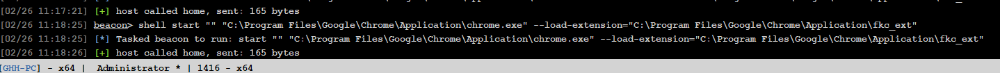
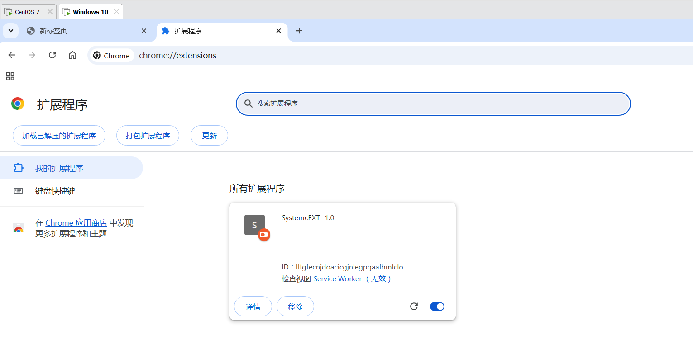
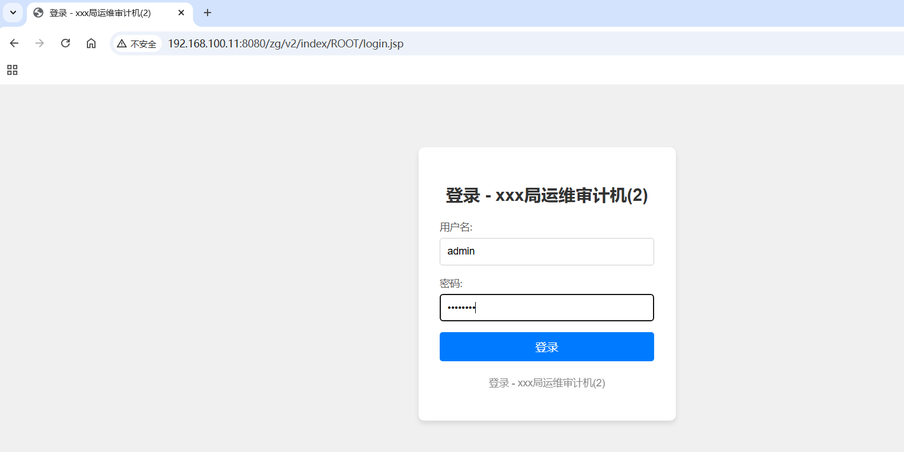
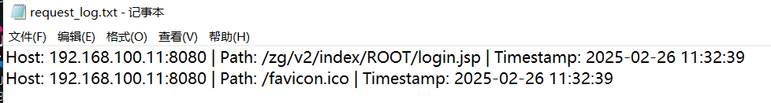
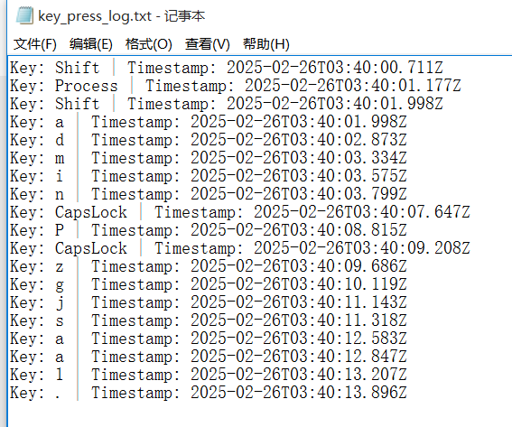
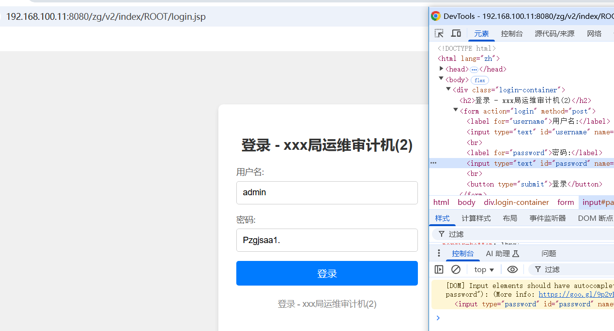

# 基于Chrome扩展插件的后门技术实现

**免责声明：由于传播、利用本文所发布的而造成的任何直接或者间接的后果及损失，均由使用者本人承担**

突发奇想的小研究，具体实现和利用已经拓展还有待发掘

场景用于当我们拿下一台受害机之后

​	利用受害机的Chrome浏览器，通过加载Chrome扩展，实现js窃取受害者键盘输入的内容，或者访问的网页地址等

 原理：

 1.通过终端启动chrome并加载恶意插件(fkc_ext)

 2.插件将用户的请求以及按键情况，发送到监听服务(FKC.exe)

 3.监听的服务再将发来的内容写入到文件中保存(生成输入信息、访问URL)

**详细演示：**
https://seven1an.github.io/2025/02/26/%E5%9F%BA%E4%BA%8EChrome%E6%89%A9%E5%B1%95%E6%8F%92%E4%BB%B6%E7%9A%84%E5%90%8E%E9%97%A8%E6%8A%80%E6%9C%AF%E5%AE%9E%E7%8E%B0/

**简单介绍：**

​	1.命令行`Chrome.exe --load-extension="fkc_ext路径"`	来加载插件启动Chrome

​	此时Chrome会自动打开并加载插件 这时等待受害者使用

​	2.`FKC.exe -p port`	设置监听端口

​	这个端口务必与 `fkc_ext\background.js`和`fkc_ext\content.js`中的通信地址一致

​	

​	3.受害这在Chrome浏览器中，访问的网页地址，输入内容将会被记录在`C:\Users\<当前用户名>\AppData\Local`

​	目录下的`key_press.txt`和`request_log.txt`中

这里得到键盘输入信息admin摁了一下大写输入P然后又摁回小写输入zgjsaa1.

也就是说账号是admin

密码是Pzgjsaa1.

与实际输入对比

确认url为 http://192.168.100.11:8080/zg/v2/index/ROOT/login.jsp无误

账号密码也正确
